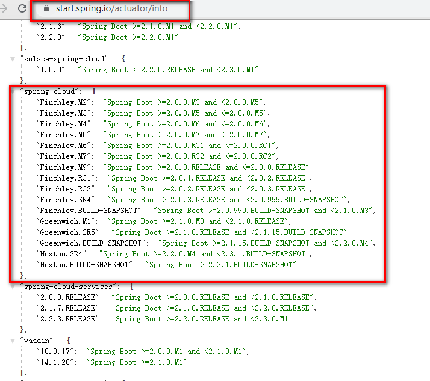

# 分布式架构体系

## 服务注册与发现
### Eureka
Eureka包含服务端和客户端
#### EurekaServer
Eureka服务端配置
#### EurekaClient
Eureka客户端配置
### Zookeeper
安装Zookeeper(3.4.8)

配置信息
```properties
# 注册到zookeeper上zookeeper的地址，如果是集群，就逗号分割
spring.cloud.zookeeper.connect-string=127.0.0.1:2181
``` 
### Consul
    - Nacos
## 服务调用
    - feign
## 服务熔断
    - Hystrix 
## 负载均衡
    - Ribbon
## 服务降级
    
## 服务消息队列
## 配置中心管理
    - SpringCloudConfig
## 服务网关
    - zuul
    - gateway
## 服务监控
## 全链路追踪
## 自动化构建部署
## 服务定时任务调度


## 技术选型

几个重要的网址

https://spring.io/projects/spring-cloud 最下面有一个对应关系


https://start.spring.io/actuator/info

SpringBoot 2.x

SpringCloud  H


